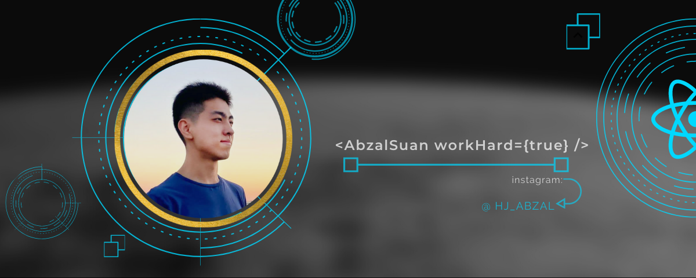

### Hi there 👋, my name is Abzal Suan

#### I am a Front-end developer...
 ...who has a results-focused attitude to creating SPA, using most popular frameworks as React, Vue and Angular.
 
I have a sufficient experience in Frontend development from small pet projects to large architectural and testable web applications.

My most important skills are problem solving, proactivity and total contribution.

Skills: React, Redux, JavaScript, TypeScript, HTML5, CSS3, Unit Tests, SnapShot, Storybook, Angular, Ngrx, Angular Material

        

